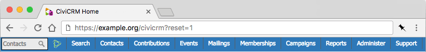

# Environment Indicator for CiviCRM

This CiviCRM extension adds javascript to apply colors from the [Drupal Environment Indicator module](https://drupal.org/project/environment_indicator) to CiviCRM's menu, providing a visual indication of the current site environment to people using CiviCRM.

Provided you have the Drupal Environment Indicator module installed and configured, this extension will simply replicate to CiviCRM's menu the colour changes applied by Environment Indicator module to your Drupal menu.

## Drupal Only

The Environment Indicator module is a Drupal module, so this extension is CMS-specific. It won't do anything if Environment Indicator is not installed and enabled.

## Installation

### Web UI

Install the extension using the CiviCRM UI, [per CiviCRM documentation](https://docs.civicrm.org/user/en/4.7/introduction/extensions/#installing-extensions).

### CLI, using "cv"

If you have `cv` installed, you can install `nz.co.fuzion.environmentindicator` from the commandline by running:

    cv ext:download nz.co.fuzion.environmentindicator
    cv ext:enable nz.co.fuzion.environmentindicator

## Configuration

No special configuration is required for this extension.

## How it works

This extension adds an additional JS behaviour on load which retrieves the colours from Drupal's Admin Menu and applies them to CiviCRM's menu as well.

## Sponsorship

The development of this extension was donated by [Fuzion](https://fuzion.co.nz) to the CiviCRM community and Fuzion's CiviCRM customers.

## Support

This extension is contributed by [Fuzion](https://www.fuzion.co.nz). 

Contributions and bug reports are welcome via the the [contrib.environmentindicator issue queue](https://github.com/fuzionnz/contrib.environmentindicator/issues).

Community support is available via CiviCRM community channels:

* [CiviCRM chat](https://chat.civicrm.org)
* [CiviCRM question & answer forum on StackExchange](https://civicrm.stackexchange.com)

Contact us - info@fuzion.co.nz - for professional support and development requests.